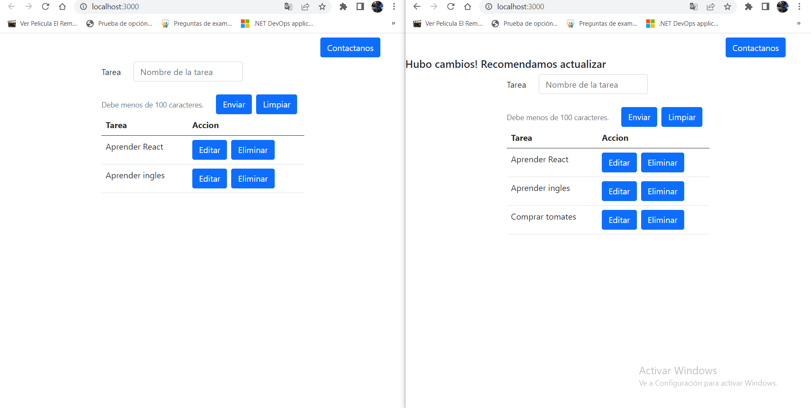

# React parte 2

> Esta va a ser una continuacion de un mini tutorial de React que hice con anterioridad, para verlo les dejo el [Link.](https://github.com/leandroVece/React/tree/master)

## Composicion de componentes 

En ese trabajo hicimos uso de UseContext para lograr una comunicacion entre elementos "abuelos" a elementos "ñietos". sin embargo esa no era la unica manera de lograrlo.

La composicion de componentes es un patrón para crear componentes que nos da libertad para elegir dónde y cómo usamos nuestros componentes. Esto nos permite hacer a los componentes más fáciles de integrar al resto de componentes, y agiliza el proceso de reutilizar o hacer cambios en los componentes.

¿Dónde los guardamos? Este problema también se conoce como state colocation.

- Máxima cercanía a la relevancia: El estado debe estar tan cerca como sea posible de donde lo estemos usando y actualizando.
- Stateful vs stateless: Separar lógica y estado de componentes que manejan UI.

Hay que examinar que componentes manejan su propio estado, asumiendo que todos los componentes consumen el estado general de la app queremos encontrar a los componentes que crean un estado aparte del general. De esta manera podemos dividir componentes, de un lado tendremos a los componentes que solo consumen el estado general de la app y esos son componentes stateless(de interfaz, de UI), y del otro lado a los componentes que crean su propio código interno (estado) serán los stateful y siguiendo el principio de separar al estado de la UI podemos dividir a estos componentes con su propio estado en 2 uno stateful(interactivo), y el otro en stateless(estatico).

Sin embargo, esto tiene el defecto que mientras mas grande es nuestra aplicacion mas codigo tendremos y nos veremos en algun momento obligados a usar useContext.

Hagamos unos cuantos cambios en nuestro codigo.

**AppIU**

    import React from "react";
    import Table from "../Table";
    import Form from "../Form";
    import { GlobalContext } from "../../Context/GlobalContext";
    import Modal from "../Modal";
    import TableRow from "../TableRow";

    function AppIU() {

        //const value = React.useContext(GlobalContext);
        const {
            updateData,
            createData,
            dataToEdit,
            setDataToEdit,
            DataTask,
        } = React.useContext(GlobalContext)

        return (

            

                <Modal />
                <Form
                    updateData={updateData}
                    createData={createData}
                    dataToEdit={dataToEdit}
                    setDataToEdit={setDataToEdit} />
                {
                    <Table>

                        {DataTask.length > 0 ? (
                            DataTask.map((x, index) => (
                                <TableRow
                                    key={index}
                                    el={x}
                                />
                            ))) : (
                            <tr>
                                <td colSpan="2">Sin datos</td>
                            </tr>
                        )}
                    </Table>
                }
            

        )
    }

    export default AppIU;

**Table**

    import React from "react";

    const Table = (props) => {        

    return (
        

            <table className="table">
                <thead>
                    <tr>
                        <th>Tarea</th>
                        <th>Accion</th>
                    </tr>
                </thead>
                <tbody>
                    {props.children}
                </tbody>
            </table>
        

        );
    }

    export default Table;

## ¿Qué son las render props y render functions?

Estos dos componentes seran buenos complementos para ayudar a la compocicion de nuestra aplicacion.

Los renders functions es el patrón de entregar la información de nuestro componente en una función. Nosotros podemos crear nuestros propios componentes que usen este patrón, que reciban una función para que le podamos enviar la información que queremos proveer y luego si, renderizar los componentes que ya tienen la info gracias a la función.

Las render props nos permiten ser más específicos sobre que vamos a renderizar, cuando y donde vamos a renderizar cada parte del contenido de nuestros componentes. Ya no mandamos la función dentro del componente, si no que la enviamos en alguna otra propiedad del componente.

Ahora que mas o menos entendemos, Eliminemos en este trabajo el uso de useContext.

>Nota: Yo o hare manualmente, pero como cada tema que fui tocando lo dividi en ramas uno puede descargar esa rama para la comodidad o retarse a si mismo a hacerlo de manera manual.

DEspues de hacer los cambios crearemos un archivo Loder para los mismos los obtendremos de este [Link](https://loading.io/spinner/). Luego iremos a nuestro archivo AppIu para hacer unos pequeños cambios.

    import React, { useEffect, useState } from "react";
    import Table from "../Table";
    import Loader from "../Loader";
    import Form from "../Form";
    //import { GlobalContext } from "../../Context/GlobalContext";
    import Modal from "../Modal";
    import { useLocalStorage } from "../../Context/LocalStorage";
    import TableRow from "../TableRow";

    function AppIU() {

        //const value = React.useContext(GlobalContext);
        const [loading, setLoading] = useState(false);
        const [DataToEdit, setDataToEdit] = useState(null);
        const { DataTask, SaveDataTask } = useLocalStorage('task_V1', []);

        useEffect(() => {
            setLoading(true)
            setTimeout(() => {
                setLoading(false)
            }, 2000)
        }, [DataTask]);

        const createData = (data) => {
            data.id = Date.now();
            const lista = [...DataTask, data];
            SaveDataTask(lista);
        }

        const updateData = (data) => {
            let newData = DataTask.map((el) => (el.id === data.id ? data : el));;
            SaveDataTask(newData);
        };

        const deleteData = (id) => {
            let isDelete = window.confirm(
                `¿Estás seguro de eliminar el registro con el id '${id}'?`
            );
            if (isDelete) {
                let newData = DataTask.filter((el) => el.id !== id);
                SaveDataTask(newData);
            } else {
                return;
            }
        };

        return (

            

                <Modal />
                <Form
                    updateData={updateData}
                    createData={createData}
                    DataToEdit={DataToEdit}
                    setDataToEdit={setDataToEdit} />
                {
                    <Table>
                        {loading && <Loader />}
                        {!loading && DataTask.length > 0 ? (
                            DataTask.map((x, index) => (
                                <TableRow
                                    key={index}
                                    el={x}
                                    setDataToEdit={setDataToEdit}
                                    deleteData={deleteData}

                                />
                            ))) : (
                            <tr>
                                <td colSpan="2">Sin datos</td>
                            </tr>
                        )}
                    </Table>
                }
            

        )
    }

    export default AppIU;

Como te abras dado cuenta cree un nuevo useEffect para este archivo Loader, el cual pune su valor en falso luego de dos segundos.
Al mismo tiempo en nuetro componente valido si loading es true para que lo renderice y si es falso y DataTask tiene elementos renderizara nuestra tabla de lo contrario solo mostrara unas simples palabras de "No hay datos".

>Nota: esto puede no tener mucho sentido para el ejemplo, pero la simplicidad es solo para fines practicos como lo use quedara a criterio de cada uno.

Ahora que vimos de manera muy apresurada este ejemplo, vamos a convertirlo a hacer uso de las renders props y functions.

Primero cambiemos el contenido de nuestra funcion render de AppIU

        

            <Modal />
            <Form
                updateData={updateData}
                createData={createData}
                DataToEdit={DataToEdit}
                setDataToEdit={setDataToEdit} />
            {
                <Table
                    loading={loading}
                    onLoading={() => <Loader />}
                >
                    {!loading && DataTask.length > 0 ? (
                        DataTask.map((x, index) => (
                            <TableRow
                                key={index}
                                el={x}
                                setDataToEdit={setDataToEdit}
                                deleteData={deleteData}
                            />
                        ))) : (
                        <tr>
                            <td colSpan="2">Sin datos</td>
                        </tr>
                    )}
                </Table>
            }
        

Luego el de la table

    const Table = (props) => {
        
        if (props.loading) {
            return props.loading && props.onLoading()
        } else
            return (
                

                    <table className="table">
                        <thead>
                            <tr>
                                <th>Tarea</th>
                                <th>Accion</th>
                            </tr>
                        </thead>
                        <tbody>
                            {props.children}
                        </tbody>
                    </table>
                

            );
    }

## ¿Qué son los High Order Components?

Las función de orden superior (HOF) y es aquella que recibe una función como parámetro y retornan otra función.

Los componentes en React se benefician de esto al parecer por ser funciones.
Si a un componente le pasamos como parámetro otro componente( equivale a función que recibe otra función) y luego regresamos otro componente, que mediante sus propias props y las variables (con efecto closure) sea capaz de modificar el componente que se recibió antes, entonces entregamos un resultado diferente para cada componente que se le pase al HOC.

Con esto podemos pasarle propiedades a nuestro componente (como el ejemplo de la API de la clase) algo como lo que hace el context y los hooks. (proveer props a los componentes de react).

También podemos agregarle elementos al componente o convertirlo en hijo de otro componente.

Creemos un archivo una nueva carpeta llamada ChangeAlert en el vamos a colocar el index.js y un segundo archivo llamado WihtListener.js 

>Nota: por convencion Wiht se les antepone cuando usando los HOC.

**WihtListener.js**

    import React from 'react';

    function withListener(WrappedComponent) {

        return function WrappedComponentWithStorageListener(props) {
            const [storageChange, setStorageChange] = React.useState(false);

            React.useEffect(() => {
                window.addEventListener('storage', (change) => {
                    if (change.key === "task_V1") {
                        setStorageChange(true);
                    }
                })
            }, [])

            return (
                <WrappedComponent
                    show={storageChange}
                />
            );
        }
    }

    export { withListener };

**index.js**

    import React from 'react';
    import { withListener } from './withListener';

    function ChangeAlert({ show }) {
        if (show) {
            return <h5 className='w-75'>Hubo cambios! Recomendamos actualizar</h5>;
        } else {
            return null;
        }
    }

    const ChangeAlertWithStorageListener = withListener(ChangeAlert);

    export { ChangeAlertWithStorageListener };

Creamos un HOC llamado whitListener que devuelve un componente react que llamamos WrappedComponentWithStorageListener que por dentro tiene un estado donde vamos a guardar si hubi cambios en nuestra aplicacion.

Este cambio se lo enviamos a nustros WrappedComponent por medio de las propiedad Show.

Ademas este HOC se lo estamos aplicando a nuestro componente ChangeAlert(index.js)  en donde estamos creando nuestra constante llamada ChangeAlertWithStorageListener y este componente cuando sea true nos va a devolver el texto que hemos puesto dentro.

¿Pero que hace esto? simplemente, si tenemos abierto nuestra aplicacion en mas de una pestaña y hacemos cambios. nos informara de estos cambios.

>Nota: En esta imagen en la pantalla de la izquierda borre el tercer elemento y el de la de la derecha reacciono a ese cambio.

Con estos temas nuevos que hemos tocado seguramente te preguntaras ¿cual entonces debemos usar? aunque es una pregunta que puede no tener una respuesta fija siempre podemos ver las ventajas y desventaja de cada uno para optar la eleccion mas acertada.

Cuando se trara de Maquetación
- Render props:
En el caso de las render props no tenemos los componentes y las validaciones en el mismo lugar, ahora pasamos la validaciones al componente en si y lo que se vaya a renderizar lo pasamos por una render prop.

- Custom Hooks:
En los hooks podemos utilizar las propiedades, información y actualizadores. Estas son herramientas que nos brindan para que luego, con ayuda de la logica, escojamos que se renderiza y que no.

En este caso el ganadora de la competencia: Render props

Cuando se trata de compartir logica entre componentes

- Render props:
Estas nos permiten compartir información con funciones, sus parámetros son los que nos van a servir para llevar la información de padres a hijos. Si nuestra lógica crece, y pasamos a tener componentes dentro de más componentes, los render props no escalan del todo bien y se pueden volver engorrosos.

- HOCs:
Nuestras súper funciones que retornan funciones hasta que retornan un componente, nos son muy útiles para compartir información, ya que lo que vamos a hacer es “envolver” nuestros componentes y automáticamente compartimos la información entre componentes. Los HOCs tienen el mismo problema que los render props a la larga.

- Custom Hooks:
Con los React Hooks, sean oficiales o no, se simplifica mucho el pasar información entre componentes y escala de muy buena manera a la larga.

En este caso el ganadora de la competencia: React/Custom Hooks